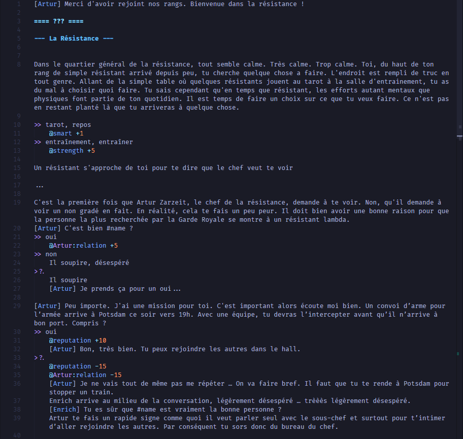
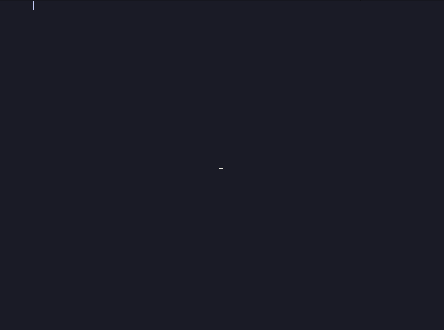

<center><p align="center"> 
  
  <h1> vscode-pychemin </h1>
</p></center>

Provides syntax highlighting (and much more to come) for [PyChemin](https://github.com/ewen-lbh/pychemin), a minimal language to describe interactive, terminal-based text adventure games.

## Features

By order of implementation complexity (soonest = easiest to implement)

- [x] Syntax highlighting
  
  _Color theme: [Tokyo Night](https://marketplace.visualstudio.com/items?itemName=enkia.tokyo-night) by [enkia](https://marketplace.visualstudio.com/publishers/enkia)_

- [x] Snippets for headings, characters lines & more
  
- [ ] Outline support
- [ ] Autocompletion for character names, stats and interpolations
- [ ] Linting (shows error when character is not defined, etc.)
- [ ] Jump-to-declaration for characters, stats and `-> file` statements

## Requirements

To run `.pychemin` files, install the _pychemin interpreter_:

```sh-session
$ pip install pychemin
$ pychemin --version
```

## Known Issues

- Interpolation `my thing #name` is not highlighted correctly.
- Percent operator (`@speed 50%`) is not highlighted (but ewen-lbh/pychemin doesn't even use it yet)
